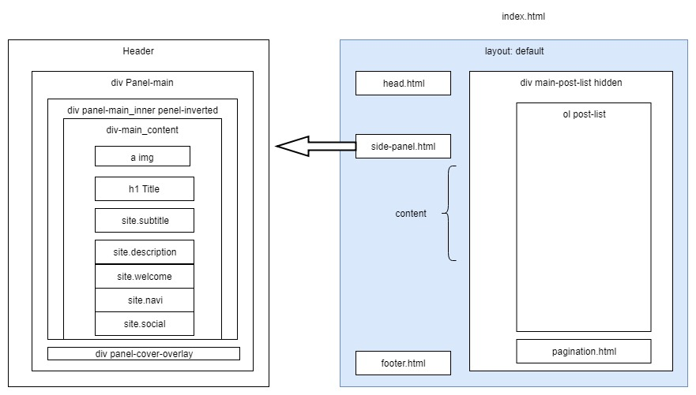

### 项目在张展示

在线展示地址: [cool panda](https://coolpanda.ml/)

### 前置知识

工欲善其事，必行利其器。

为充分利用github page 和 jekyll 的便利，建议先学习jekyll的使用。
推荐一个教学视频——[Jekyll - 静态网站生成器教程](https://www.bilibili.com/video/av25864819/)

### 安装
1, Install ruby-build tool:
```bash
$ sudo yum install git-core zlib zlib-devel gcc-c++ patch readline readline-devel libyaml-devel libffi-devel openssl-devel make bzip2 autoconf automake libtool bison curl sqlite-devel
```
2, Install rbenv and ruby-buld:
```bash
curl -sL https://github.com/rbenv/rbenv-installer/raw/master/bin/rbenv-installer | bash -
echo 'export PATH="$HOME/.rbenv/bin:$PATH"' >> ~/.bashrc
echo 'eval "$(rbenv init -)"' >> ~/.bashrc
source ~/.bashrc
```
3, Install ruby:
```bash
rbenv install -l
rbenv install 2.6.5
rbenv global 2.6.5
```

4, Install jekyll, bundler:
```bash
gem install jekyll bundler
```

### 使用

```bash
$ git clone https://github.com/Albert-W/cool-panda.git your_site
$ cd your_site
$ bundler update
$ bundler install
$ bundler exec jekyll serve
```
jekyll 启动网络服务器，点击 http://127.0.0.1:4000 就可查看网站。

项目全局配置文件是 _config.yml， 主入口文件是根目录下的index.html。
<!-- 主页面布局文件是 _layouts/default.html。 -->

<!-- 整个项目结构如下： -->
<!--  -->


<!-- 离线展示 -->
<!--  -->
<!--  -->

### Licence

Great thanks to [Dale Anthony](https://github.com/daleanthony) and his [Uno](https://github.com/daleanthony/uno). Vno Jekyll is followed with Uno and be licensed as [Creative Commons Attribution 4.0 International](http://creativecommons.org/licenses/by/4.0/). See the link for more information.
